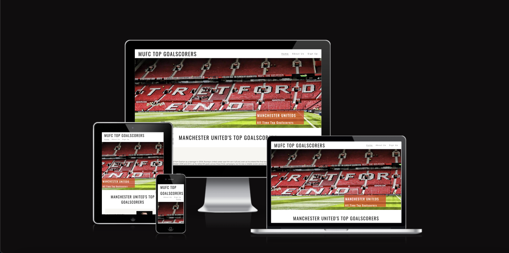
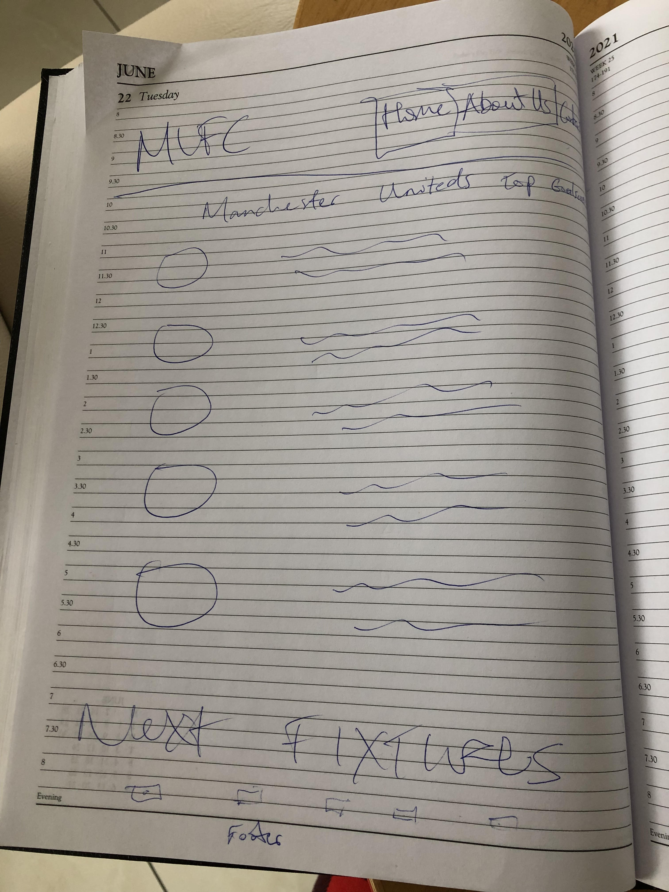
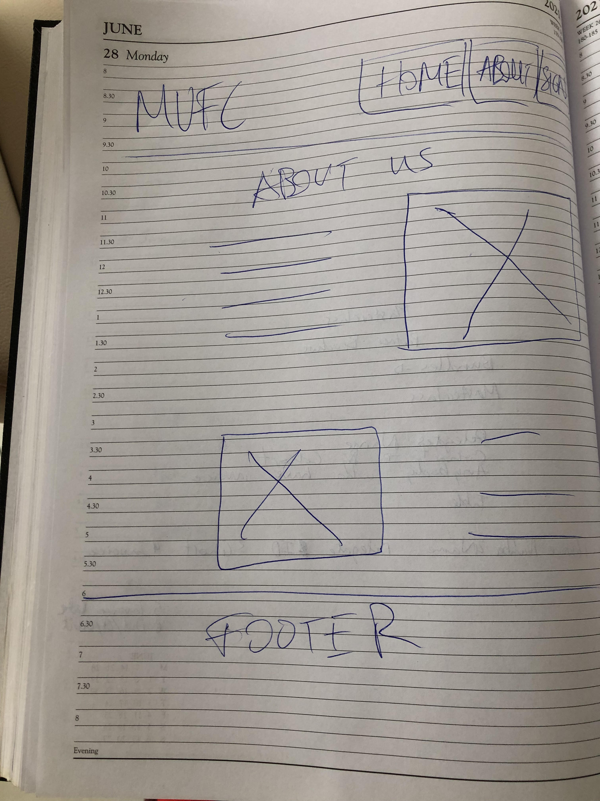
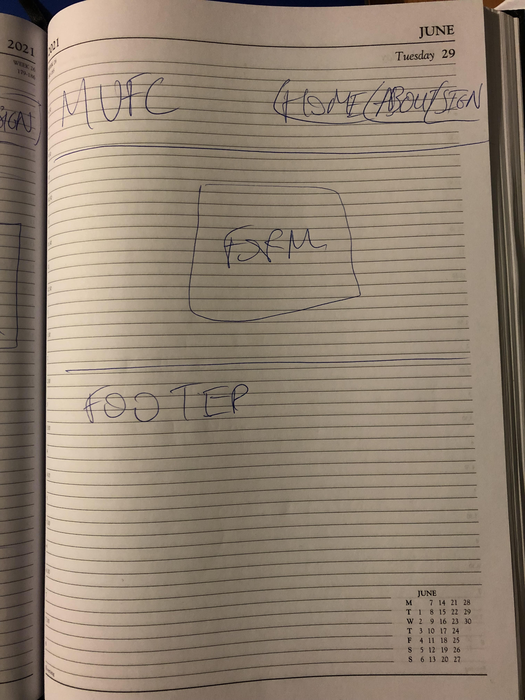
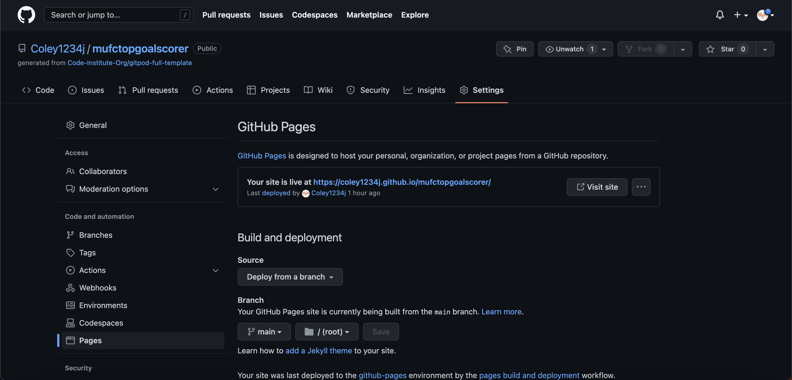

# MUFC Top Goalscorers  
## [Visit the webstie here](https://coley1234j.github.io/mufctopgoalscorer/)
  Created to showcase the history of Manchester United FC on a website as a simple webside for avid fans to look up and discover their clubs history in particular those interested in the top goalscoring players in the clubs history. The website was made for educational purposes only.

Created to showcase the history of Manchester United FC on a website as a simple webside for avid fans to look up and discover their clubs history in particular those interested in the top goalscoring players in the clubs history. The website was made for educational purposes only.

This website is made up of the following sections:

1. Home  
2. About Us  
3. Sign Up  
4. Thank You Page  

# User Goals

The business goals for this website are:

- To showcase Manchester United's top goalscoring players  
- To build a community of Manchester United Fans through Newlsetters and Webinars  
- Once a large enough community is built, begin offering paid memberhsips with more offers like exclusive webinars  
- Partner with travel agents and travel package companies to offer exclusive deals to data base  

The user goals of this website are:  

- As a first time visitor, I want to find a community who share my passion for Manchester United  
- As a first time visitor, I want to easily sign up to newsletters  
- As a first time visitor, I want to easily sign up to exclusive webinars with former players  
- As a recurring or first time visitor, I want to easily find who Manchester United top goalscorers are  
- As a recurring or first time visitor, I want to find information from a trusted website/community  

# Design  
## Colour Scheme
  
The main colours used across the website are rgba(218, 41, 28,), white and grey. The choice of red was used as it's the type of red used for manchester united brand i.e jerseys, logos, products, etc. so it  was important to showcase that red on the website. 
   
## Typography  
  
I used Google fonts 'Oswald' and 'Roboto' across the entire website, I felt 'Oswald' was a text that can be easily read and a text that seems to be standard across educational/historical websites. I used google fonts to help me decide on what text to use for the body of my website and that's where I found 'Roboto' which reads well alongside 'Oswald'. I also put Sans Serif as the fallback font in case for any reason the font isn't being imported into the site correctly.

## Imagery

The imagery used in the website is important. The large, background hero images across the site are designed to make the user feel like a fan. They include images of the Manchester United stadium, Old Trafford, and of fans in the the stadium allowing the user to feel part of the community of fans.

## Wireframes 

  ### Home Page
    

  ### About Us Page
    

  ### Sign Up Page
    

## Features  
- Responsive on all device sizes

- Interactive elements

# Technologies Used

## Languages Used
   - HTML5
   - CSS3

## Frameworks, Libraries & Programs Used

- Google Fonts:
   - Google fonts were used to help import the Oswald and Roboto font into the style.css file which is used on all pages throughout the project.
- Font Awesome:
   - Font Awesome was used on all pages throughout the website to add icons for aesthetic and UX purposes.
- Git
   - Git was used for version control by utilizing the Gitpod terminal to commit to Git and Push to GitHub.
- GitHub:
   - GitHub is used to store the projects code after being pushed from Git.

# Testing

## WC3 Validator  
  
The W3C Markup Validator and W3C CSS Validator Services were used to validate every page of the project to ensure there were no syntax errors in the project.  
- [W3C Markup Validator - Results](https://validator.w3.org/unicorn/check?ucn_uri=https%3A%2F%2Fcoley1234j.github.io%2Fmufctopgoalscorer%2F&ucn_lang=en&ucn_task=conformance#)
- [W3C CSS Validator - Results](https://jigsaw.w3.org/css-validator/validator?uri=https%3A%2F%2Fcoley1234j.github.io%2Fmufctopgoalscorer%2F&profile=css3svg&usermedium=all&warning=1&vextwarning=&lang=en)

## Testing User Stories from User Experience (UX) Section  

1. ## As a recurring or first time visitor, I want to easily find who Manchester United top goalscorers are.  
   - Upon entering the site, the users lands on the home page with the MUFC Top goalsocrer logo and nav bar allowing users to go to pages of their choice  
   - Underneath this there is the home page hero image along with the cover text 'Manchester Uniteds All Time Top Goalscorers indicating exactly to the user what the website contains  
   - The user then has the option to scroll down the page to see the list of the manchester united top goals scorers and also manchester uniteds next fixtures  
  
2. ## As a first time visitor, I want to easily sign up to newsletters  
   - Once the user has navigated to the About Us page they can read about newsletters click the call to action 'Sign up here' to go to the sign up page
   - The user can also use the navigation bar to find the 'sign up' page in order to sign up to the newsletter.
   - Once the user enters their name and address they have signed up to the database.
  
3. ## As a first time visitor, I want to easily sign up to exclusive webinars with former players  
   - Once the user has navigated to the About Us page they can read about webinars and click the call to action 'Sign up here' to go to the sign up page.
   - The user can also use the navigation bar to find the 'sign up' page in order to sign up to the webinars.
   - Once the user enters their name and address they have signed up to the database.
  
4. ## As a first time visitor, I want to find a community who share my passion for Manchester United  
   - Once the user enters the website they can navigate to the footers on any page by scrolling down to the bottom of the page
   - Once here the user can choose from four different social platoform links to click to and to join the community.
   - These social links in the footer open in a new tab making sure that if a user clicks on one social media link they have not lost where they were on the website and thus the other social links to join.  

5. ## As a recurring or first time visitor, I want to find information from a trusted website/community
   - When the user enters the site they can see the information straight away and they can see in the navbar that there is the website offers newsletters and webinars from experts, gaining the users trust.
   - As a recurring visitor the user knows to simply scroll on the site to get their information.

## Further Testing

   - The Website was tested on Google Chrome, Internet Explorer, Microsoft Edge and Safari browsers.
   - The website was viewed on a variety of devices such as Desktop, Laptop, & iPhone 8.
A large amount of testing was done to ensure that all pages were linking correctly.
   - Family members were asked to review the site on both mobile and laptops to point out any bugs or user experience issues they had.

## Known Bugs
   - On some mobile device. screens the footer on the about us page can become distorted or not appearing.
   - The footer social links are sending to 404 error page.

## Deployment

I deployed this website by using GitPages and following the below steps:

GitHub pages deployment

1. Log in to GitHub
2. In your Repository section, select the project repository that you want to deploy
3. In the menu located at the top of this section, click 'Settings'
4. Select 'Pages' on the menu on the left side of the screen - Halfway down the page
5. In the source section, select branch 'Master' and save
5. The page is then given a site URL which you will see above the source section, it will look like the following:  

  
  
Forking the GitHub Repository  
By forking the GitHub Repository we make a copy of the original repository on our GitHub account to view and/or make changes without affecting the original repository by using the following steps...  

1. Log in to GitHub and locate the GitHub Repository
2. At the top of the Repository (not top of page) just above the "Settings" Button on the menu, locate the "Fork" Button.
3. You should now have a copy of the original repository in your GitHub account.

Making a Local Clone  
1. Log in to GitHub and locate the GitHub Repository
2. Under the repository name, click "Clone or download".
3. To clone the repository using HTTPS, under "Clone with HTTPS", copy the link.
4. Open Git Bash
5. Change the current working directory to the location where you want the cloned directory to be made.
6. Type git clone, and then paste the URL you copied in Step 3.
7. Press Enter. Your local clone will be created.  
  
# Credit  
  
## Code
- [san Webcorner](https://www.sanwebcorner.com/2017/05/how-to-create-simple-404-error-page-and.html), used to help create 404 redirect page
- Code Institute's sample project [Love Running project](https://learn.codeinstitute.net/courses/course-v1:CodeInstitute+LR101+2021_T1/courseware/4a07c57382724cfda5834497317f24d5/f2db5fd401004fccb43b01a6066a5333/) helped to give me a starting platform to build my website.

## Content
- Unless stated below, the content was written by the developer.  
- Information on Manchester United top goalscorers were used from this page [here](https://www.manutd.com/en/news/detail/who-are-the-top-10-goal-scorers-in-man-utd-history-rooney-charlton-law-best-giggs)

## Media
All Images were downloaded from google and uploaded by the developer.

## Acknowledgements
My Mentor Harry Dhillon for continuous helpful feedback through out my project.
